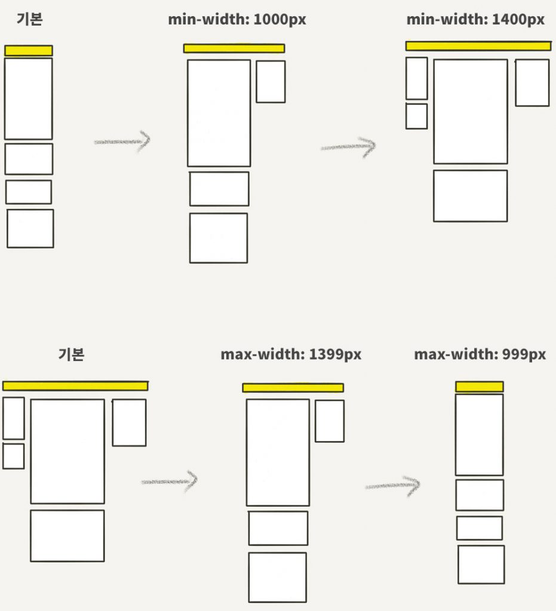
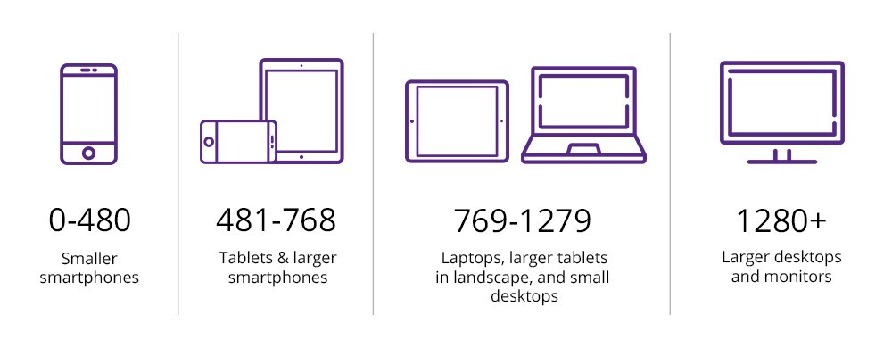

# 반응형 웹, min-width와 max-width 중 어떤 것을 사용하는게 좋을까

- 글을 시작하기 전에..  
  이 질문에 대한 답은 정답이 없으며, 작업자 개개인마다 선호하는 방식이 다를 수 있습니다.
  이 글 역시 제 생각을 쓴 것이니 참고 삼아 봐주세요~

- 반응형 웹을 만드는 요소는 여러가지가 있지만, 가장 기본적으로 CSS의 미디어 쿼리가 빠질 수 없지요.  
  특히 미디어 쿼리의 속성들 중 min-width 또는 max-width를 이용해 브라우저 폭을 인식해서 각 조건에 맞게 처리해 주는 방식이 널리 쓰입니다.

- 아래 코드↓는 min-width(최소 width)가 1000px, 즉 1000px 이상인 경우에 적용되는 코드이고

```css
@media (min-width: 1000px) {
  body {
    background: gold;
  }
}
```

- 아래 코드↓는 max-width(최대 width)가 1000px, 즉 1000px 이하인 경우에 적용되는 코드지요.

```css
@media (max-width: 1000px) {
  body {
    background: gold;
  }
}
```

## min-width를 사용하는 경우


- 스마트폰 등 가장 작은 사이즈에서의 레이아웃을 기본으로 하고, 점차 확장되어가는 형태로 CSS를 작성합니다.

## max-width를 사용하는 경우



- 데스크탑용의 가장 큰 화면 사이즈의 레이아웃을 기본으로 하고, 점차 축소하는 형태로 CSS를 작성합니다.

- 저는 개인적으로 min-width를 사용해서 점점 확장해가는 방식을 선호하는데, 이유는 대부분의 경우 작은 사이즈에서의 레이아웃이 더 심플하기 때문이에요. 레이아웃이 심플하다는 것은 그만큼 CSS 코드도 단순하다는 이야기지요. 심플한 것에 점점 무언가를 추가하는 것이, 복잡한 것에서 점점 빼가며 단순화하는 것 보다 낫다고 생각합니다. 복잡한 레이아웃을 위해 작성한 CSS 코드를 단순한 형태의 레이아웃으로 바꾸려면 복잡한 기능들을 취소하는 코드도 그만큼 덕지덕지 붙어야 하거든요. 물론 디자인에 따라 꼭 맞는 이야기라고 할 수는 없긴 하지만, 확률적으로 좀 더 낫더라고요.

- 그리고 작업을 하다 보면 꼭 한가지만 쓰는게 아니라 min-width와 max-width 둘을 섞어쓰는 편이 더 편한 경우도 있어요. 중요한건, 정확한 의도를 가지고 그에 따라 전략적으로 사용하는 것입니다.

- 미디어 쿼리를 지원하지 않는 스마트폰, 미디어 쿼리를 지원하지 않는 구식 브라우저 등을 고려하면 관련해서 더 할 이야기가 많지만, 대부분 최신 브라우저를 사용하는 요즘에는 크게 와닿는 이야기가 아니므로 여기서는 패스할게요~~(절대 귀찮아서 그런 것이 아님)

## 반응형 분기점



- 스마트폰 세로: 0px ~ 480px
- 스마트폰 가로, 태블릿 : 481px ~ 768px
- 태블릿 가로, 노트북 : 769px ~ 1279px
- 데스크탑 : 1280px ~

### 이에 맞는 미디어 쿼리는 아래와 같을 수 있겠다

```css
/* 노트북 & 테블릿 가로 (해상도 1024px ~ 1279px)*/
@media all and (min-width: 1024px) and (max-width: 1279px) {
  //스타일 입력
}

/* 테블릿 가로 (해상도 768px ~ 1023px)*/
@media all and (min-width: 768px) and (max-width: 1023px) {
  //스타일 입력
}

/* 모바일 가로 & 테블릿 세로 (해상도 480px ~ 767px)*/
@media all and (min-width: 480px) and (max-width: 767px) {
  //스타일 입력
}

/* 모바일 세로 (해상도 ~ 479px)*/
@media all and (max-width: 479px) {
  //스타일 입력
}
```
